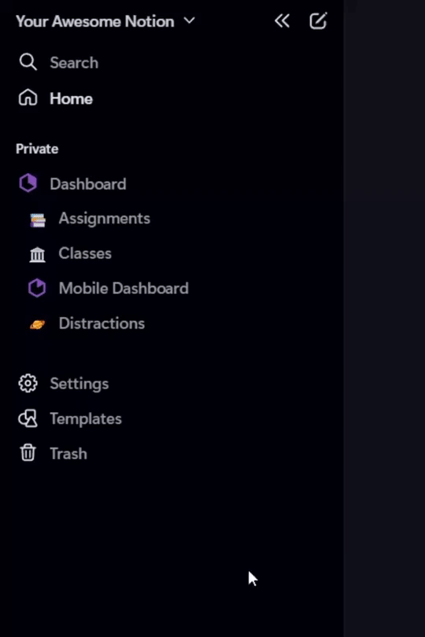

# Notion - Sidebar Toggle Button
### This is a tampermonkey / greasemonkey userscript for changing the default behavior of notion's sidebar. 

The script adds a show/hide toggle into the DOM (topbar) that then manipulates the sidebar behavior position and visibility. 
When the sidebar is set to hidden, it no longer appears on hover (as well as the hamburger button). Clicking the button makes it appear again.

> ~~I only recently started learning coding, so this is messy AF and someone can probably easily make this much more effective.~~ It's only *somewhat* messy!

***

### Demo:
