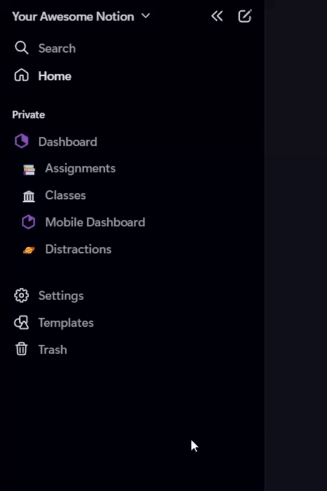

# Notion - Sidebar Toggle Button
### A Tampermonkey/Greasemonkey userscript which adds a hide/show toggle for Notion's sidebar.

> [!NOTE]
> The new [app.notion.com](https://app.notion.com/) URL/UI is now supported!

This script adds a visibility toggle into the DOM (`.notion-topbar`) which manipulates the sidebar's position and visibility to show/hide it at will. 
When the sidebar is set to hidden, it no longer appears on hover, and hamburger button is no longer shown. Clicking the button makes it appear again.

> ## Demo:
> 
